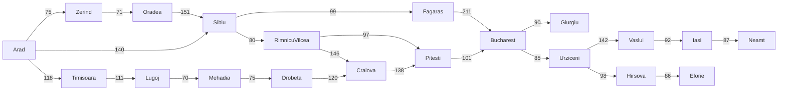

## 1. Search

#### Tree vs Graph Search

- Ref: https://www.cs.rhodes.edu/~kirlinp/courses/ai/s17/handouts/search-algs-uninformed.pdf
- Tree search can be used if the state space is a tree, otherwise graph search must be used.
- All search algorithms (BFS, DFS, uniform-cost, A*, etc) are variations of one of these (usually graph search).
- The only difference between tree search and graph search is that tree search does not need to store the **explored set**, because we are guaranteed never to attempt to visit the same state twice.

#### Measuring problem-solving performance

- **Completeness:** Is the algorithm guaranteed to find a solution when there is one, and to correctly report failure when there is not?
- **Cost optimality:** Does it find a solution with the lowest path cost of all solutions?
- **Time complexity:** How long does it take to find a solution? This can be measured in seconds, or more abstractly by the number of states and actions considered.
- **Space complexity:** How much memory is needed to perform the search?

#### Romania example from AIMA

### 1.1. Uninformed Search

|Criterion|Breath-First|Uniform-Cost|Depth-First|Depth-Limited|Iterative-Deepening|Bidirectional (if applicable)|
|---|---|---|---|---|---|---|
|Complete?|Yes|Yes|No|No|Yes|Yes|
|Optimal cost?|Yes|Yes|No|No|Yes|Yes|
|Time|$O(b^d)$|$O(b^{1+[C^*/ϵ]})$|$O(b^m)$|$O(b^ℓ)$|$O(b^d)$|$O(b^{d/2})$|
|Space|$O(b^d)$|$O(b^{1+[C^*/ϵ]})$|$O(bm)$|$O(bℓ)$|$O(bd)$|$O(b^{d/2})$|

### 1.2. Informed Search

|Algorithm|f(n)|Weight|
|---|---|---|
|A* search|g(n) + h(n)|W = 1|
|Uniform-cost search|g(n)|W = 0|
|Greedy best-first search|h(n)|W = ∞|
|Weighted A* search|g(n) + W × h(n)|1 < W < ∞|

### 1.3. Heuristics

#### Admissible Heuristics

- $h(n)$ is **admissible** if, $\forall n$, $h(n) \leq h^*(n)$
  - $h^*(n)$ = true cost to reach the goal state from n
- **Never overestimates** cost to reach goal
- Example: $h_{SLD}(n)$ never overestimates the actual road distance (roads are at best straight)
- If $h(n)$ is **admissible**, then A* using TREE-SEARCH is optimal

#### Consistent Heuristics

- $h(n)$ is consistent if, for every node $n$ and every successor $n'$ of $n$ generated by any action $a$,

  $h(n) \leq c(n,n') + h(n')$

- If $h(n)$ is consistent,

  $f(n') = g(n') + h(n')$
  
  $= g(n) + c(n,n') + h(n')$
  
  $\geq g(n) + h(n) = f(n)$

- **$f(n)$ is non-decreasing along any path**
- If $h(n)$ is **consistent**, then A* using GRAPH-SEARCH is optimal

#### Admissible vs Consistent

- Consistent $\Rightarrow$ Admissible
- Admissible $\nRightarrow$ Consistent

### 1.4. Adversarial Search

### 1.5. Local Search and Optimization

### 1.6. Constraint Satisfaction Problem

## 2. Knowledge

### 2.1. Logical Agents

#### 2.1.1. Knowledge-based Agents

#### 2.1.2. Propositional Logic

|Connective|Symbol|Statement|
|---|---|---|
|and|∧|Conjunction|
|or|∨|Disjunction (inclusive or)|
|xor|⊕,⊻|Exclusive or|
|not|~,¬|Negation|
|if...then|→,⇒|Implication (conditional statement)|
|if and only if|↔,⟺|Biconditional|

Reading materials: https://calcworkshop.com/logic/

Truth table generator: https://web.stanford.edu/class/cs103/tools/truth-table-tool/

|Topic|Link|
|---|---|
|Propositional Logic|https://calcworkshop.com/logic/propositional-logic/|
|Logical Implication|https://calcworkshop.com/logic/logical-implication/|
|Logical Equivalence|https://calcworkshop.com/logic/logical-equivalence/|
|Predicate Logic|https://calcworkshop.com/logic/predicate-logic/|
|Rules of Inference|https://calcworkshop.com/logic/rules-inference/|

### 2.2. First-Order Logic

### 2.3. Inference in First-Order Logic

## 3. Uncertainty

### 3.1. Probabilities

### 3.2. Bayes' Rule

### 3.3. Bayesian Networks

### 3.4. Hidden Markov Models

### 3.5. Markov Decision Process

## 4. Machine Learning

### 4.1. Supervised Learning
 - **Classification**:
   - **Logistic Regression**: Predicts the probability that an instance belongs to a particular class using a logistic function.
   - **Support Vector Machines (SVM)**: Finds the hyperplane that best separates classes in a high-dimensional space.
   - **Decision Trees**: Builds a tree structure to classify instances based on feature values.
   - **Random Forests**: Ensemble method that constructs multiple decision trees and combines their predictions.
   - **Gradient Boosting Machines (GBM)**: Boosting ensemble technique that builds trees sequentially, each correcting errors of the previous one.
   - **Neural Networks (Deep Learning)**: Learns complex patterns through interconnected layers of nodes, suitable for various tasks.
   - **Naive Bayes Classification**: Based on Bayes' theorem, assumes that features are conditionally independent given the class, making it simple yet effective for text classification and other tasks.
 - **Regression**:
   - **Linear Regression**: Models the relationship between dependent and independent variables using a linear equation.

### 4.2. Unsupervised Learning
- **Clustering**:
  - **K-Means Clustering**: Divides data into k clusters by minimizing the sum of squared distances from each point to its assigned cluster centroid.
  - **Hierarchical Clustering**: Builds a tree of clusters by recursively merging or splitting them.
  - **Gaussian Mixture Models**: Represents data as a mixture of Gaussian distributions, useful for modeling complex data distributions.
- **Dimensionality Reduction**:
  - **Principal Component Analysis (PCA)**: Reduces dimensionality by finding orthogonal axes that capture the maximum variance in the data.
  - **t-Distributed Stochastic Neighbor Embedding (t-SNE)**: Visualizes high-dimensional data by mapping it to a lower-dimensional space while preserving local structure.
  - **Manifold Learning**: Learns the low-dimensional structure of high-dimensional data, preserving local relationships.
- **Density Estimation**:
  - **Kernel Density Estimation**: Estimates the probability density function of a random variable based on observed data points.
- **Generative Models**:
  - **Generative Adversarial Networks (GANs)**: Consists of a generator and a discriminator trained simultaneously to generate realistic data samples.
  - **Self-Organizing Maps (SOMs)**: Organizes data points in a low-dimensional grid, preserving topological properties.

### 4.3. Semi-Supervised Learning
- **Label Propagation**: Propagates labels from labeled to unlabeled instances based on similarity in a graph representation.
- **Self-Training**: Uses predictions on unlabeled data to iteratively train a model.
- **Co-Training**: Trains multiple models on different subsets of features or views of the data and exchanges information between them.
- **Tri-Training**: Extends co-training to three models for improved performance.

### 4.4. Reinforcement Learning
- **Value-based Methods**:
  - **Q-Learning**: Learns an action-value function that maps states to the expected cumulative reward of taking an action.
  - **Deep Q Networks (DQN)**: Combines Q-learning with deep neural networks to handle high-dimensional state spaces.
- **Policy Gradient Methods**: Optimizes the policy directly by estimating gradients of expected rewards.
- **Actor-Critic Methods**: Combines value-based and policy-based approaches to learn both the value function and the policy simultaneously.

### 4.5. Deep Learning
- **Convolutional Neural Networks (CNNs)**: Specialized for grid-like data like images, using convolutional layers to extract hierarchical features.
- **Recurrent Neural Networks (RNNs)**: Process sequential data by maintaining an internal state, suitable for tasks with temporal dependencies.
- **Long Short-Term Memory (LSTM)**: A type of RNN designed to overcome the vanishing gradient problem and capture long-term dependencies.
- **Transformer Models**: Utilize self-attention mechanisms to capture global dependencies in sequential data, achieving state-of-the-art results in natural language processing tasks.

## 5. Natural Language Processing 
- **Statistical Language Models**: These models are based on statistical rules and include N-gram, Bidirectional, Exponential, and Continuous Space models. They are used for tasks such as information retrieval, speech generation, and machine learning.
- **Neural Language Models**: These models are based on neural networks and are used for more complex tasks such as speech recognition and machine translation.
- **N-Gram**: This model is based on the probability distribution of a sequence of 'n' words, where 'n' can be any number. It is used for tasks such as information retrieval and speech recognition.
- **Bidirectional**: This model analyzes text in both directions, backwards and forwards, and is used for tasks such as machine learning and speech generation.
- **Exponential**: This model uses a combination of n-grams and feature functions and is used for tasks such as machine translation and sentiment analysis.
- **Continuous Space**: This model uses a non-linear combination of weights in a neural network and is used for tasks such as speech recognition and machine translation.
- **Unigram**: This model evaluates each word or term independently and is used for tasks such as information retrieval.
- **Language Translation**: This model is used for tasks such as machine translation and sentiment analysis.
- **Text Suggestions**: This model is used for tasks such as text suggestions and sentiment analysis.
- **Parsing Tools**: This model is used for tasks such as parsing and sentiment analysis.
- **Text Classification**: This model is used for tasks such as spam detection, topic categorization, and sentiment analysis.
- **Dialog Systems and Creative Writing**: This model is used for tasks such as generating human-like text and creative writing.
- **Text Summarization**: This model is used for tasks such as automatic text summarization and sentiment analysis.
- **Large Language Models (LLMs)**: These models are trained on vast amounts of text data and can generate human-like language outputs. Examples include:
  - **Transformers**: Introduced in 2017, this model revolutionized the field of NLP. Examples include BERT, RoBERTa, and XLNet.
  - **Generative Pre-trained Language Models (GPLMs)**: These models are trained on a large corpus of text and can generate text that is coherent and natural-sounding. Examples include GPT-1, GPT-2, and GPT-3.
  - **Language Models with Attention**: These models use attention mechanisms to focus on specific parts of the input text when generating output. Examples include Longformer and BigBird.
