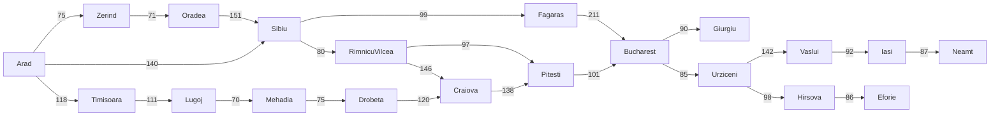

## 1. Search

#### Tree vs Graph Search

- Ref: https://www.cs.rhodes.edu/~kirlinp/courses/ai/s17/handouts/search-algs-uninformed.pdf
- Tree search can be used if the state space is a tree, otherwise graph search must be used.
- All search algorithms (BFS, DFS, uniform-cost, A*, etc) are variations of one of these (usually graph search).
- The only difference between tree search and graph search is that tree search does not need to store the **explored set**, because we are guaranteed never to attempt to visit the same state twice.

#### Measuring problem-solving performance

- **Completeness:** Is the algorithm guaranteed to find a solution when there is one, and to correctly report failure when there is not?
- **Cost optimality:** Does it find a solution with the lowest path cost of all solutions?
- **Time complexity:** How long does it take to find a solution? This can be measured in seconds, or more abstractly by the number of states and actions considered.
- **Space complexity:** How much memory is needed to perform the search?

#### Romania example from AIMA

### 1.1. Uninformed Search

|Criterion|Breath-First|Uniform-Cost|Depth-First|Depth-Limited|Iterative-Deepening|Bidirectional (if applicable)|
|---|---|---|---|---|---|---|
|Complete?|Yes|Yes|No|No|Yes|Yes|
|Optimal cost?|Yes|Yes|No|No|Yes|Yes|
|Time|$O(b^d)$|$O(b^{1+[C^*/ϵ]})$|$O(b^m)$|$O(b^ℓ)$|$O(b^d)$|$O(b^{d/2})$|
|Space|$O(b^d)$|$O(b^{1+[C^*/ϵ]})$|$O(bm)$|$O(bℓ)$|$O(bd)$|$O(b^{d/2})$|

### 1.2. Informed Search

|Algorithm|f(n)|Weight|
|---|---|---|
|A* search|g(n) + h(n)|W = 1|
|Uniform-cost search|g(n)|W = 0|
|Greedy best-first search|h(n)|W = ∞|
|Weighted A* search|g(n) + W × h(n)|1 < W < ∞|

### 1.3. Adversarial Search

### 1.4. Local Search and Optimization

### 1.5. Constraint Satisfaction Problem

## 2. Knowledge

### 2.1. Logical Agents

#### 2.1.1. Knowledge-based Agents

#### 2.1.2. Propositional Logic

### 2.2. First-Order Logic

### 2.3. Inference in First-Order Logic

## 3. Uncertainty

### 3.1. Probabilities

### 3.2. Bayes' Rule

### 3.3. Bayesian Networks

### 3.4. Hidden Markov Models

### 3.5. Markov Decision Process

## 4. Machine Learning

### 4.1. Supervised Learning

#### 4.1.1. Naive Bayes Classification

#### 4.1.2. Linear Regression

#### 4.1.3. Support Vector Machines

#### 4.1.4. Decision Trees and Random Forests

### 4.2. Unsupervised Learning

#### 4.2.1. Principal Component Analysis

#### 4.2.2. Manifold Learning

#### 4.2.3. k-Means Clustering

#### 4.2.4. Gaussian Mixture Models

#### 4.2.5. Kernel Density Estimation

## 5. Deep Learning

### 5.1. Neural Networks

### 5.2. Convolutional Neural Network

### 5.3. Recurrent Neural Network

## 6. Language
